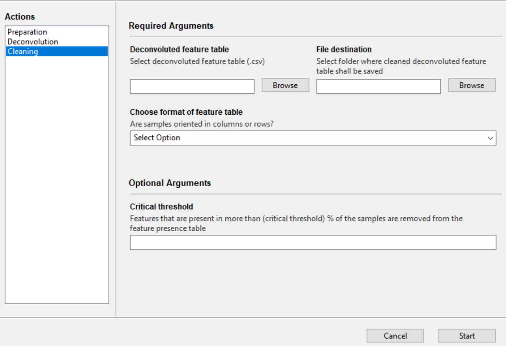

## Cleaning the deconvoluted feature table

Due to the intrinsic nature of the computational deconvolution step where an MS feature needs to be present in each row/column combination to be assigned to a specific sample, some MS features may not be present in any sample and only 0s are retained. This situation can cause trouble in subsequent analyses, such as [NP Analyst](www.npanalyst.org). It is therefore suggested users remove MS features with no presence in the deconvoluted feature table.

This tab will help guide users to remove the absent MS features quickly from the feature table and will produce a pruned deconvoluted feature table file with the prefix *cleaned_*.

In addition, this tab allows users to remove MS features that are present in more than a defined percentage of the samples. On the companion tool, this utility is called **Critical threshold**. Those MS feature might be considered as noise or too abundant and, therefore, unnecessarily inflate the feature presence table.

### The *Cleaning* tab in the companion tool

**Deconvoluted feature table** - File path to the deconvoluted feature table (.csv). This table should not be altered following the computational deconvolution step.

 **Critical threshold** - [optional] Features that are present in more than X% of the samples (X being the specified *critical threshold*) are removed from the dataset. 

**File destination** - Folder where the cleaned table should be saved. The table will be saved with the prefix *cleaned_*.

**Choose format of feature table** - The format of the deconvoluted feature table has to be determined. Are samples oriented in columns (-> features in rows) or are samples in columns (-> features in columns). If the deconvoluted feature table is untouched following the computational deconvolution step, then samples are arranged in columns.

### MultiplexMS Demo
A demonstration of the MultiplexMS workflow with detailed instructions can be downloaded [here](https://github.com/liningtonlab/MultiplexMS/releases). A copy of the demo instructions can also be found under the *demo instructions* tab on the left panel.

