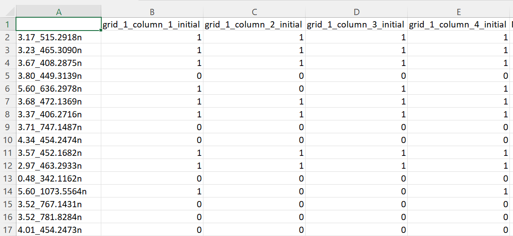
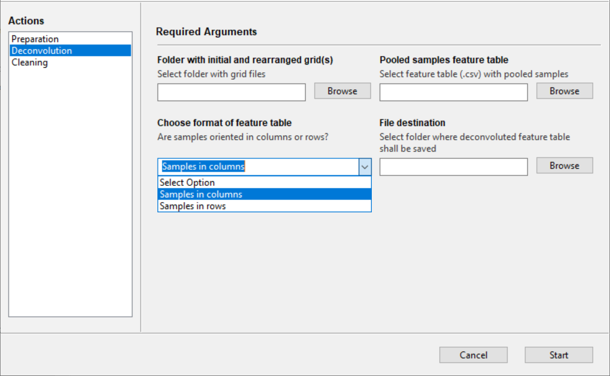

## Deconvoluting the pooled samples

### The pooled samples feature table

Users are free to use their preferred preprocessing software. As mentioned before, it is required users adopt row/column naming conventions seen in the preparation grids. A *flat* feature table (.csv) is necessary to provide to the MultiplexMS app. MS feature tables need to be in a specific format where features are designated *1* (present - above the minimum intensity threshold) or *0* (absent - zero, or below the minimum intensity threshold). The table should show which MS features are present in each pooled sample. The pooled samples feature table might be arranged so that all samples appear as columns and all features in rows. However, this is up to the user. 

Feature names do not need to follow any specific pattern. A typical feature table would look like this:

> Note that it is not important to binarize the intensities to pure presence (1) and absence (0), the table will be automatically binarized. However, choosing a sensible intensity cut-off value before processing the table is strongly advised.

### The *Deconvolution* tab in the companion tool

**Folder with initial and rearranged grid(s)** - The *grids* folder has to be selected that has been generated by the *Preparation* function

**Pooled samples feature table** - The CSV feature table has to be selected. Pooled samples appear in rows, features in columns. Sample names need to match the pooled sample names in the *grids* folder
															
**Choose format of feature table** - The format of the
feature table has to be determined. Are samples oriented in columns (-> features in rows) or are samples in columns (-> features in columns).

**File destination** - Folder where the deconvoluted feature table shall be saved. Feature table will show all sample names in rows, and features in columns. Only feature presence (1) and absence (0) will be shown. 

> It is possible that the deconvoluted (reconstituted) peak table contains empty features (only 0s) after the deconvolution step. This might prevent you from using this table in other procedures, like NP Analyst, right away. Consult the *Cleaning* tab for how to remove absent features from the freshly deconvoluted table.