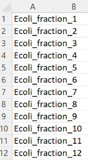
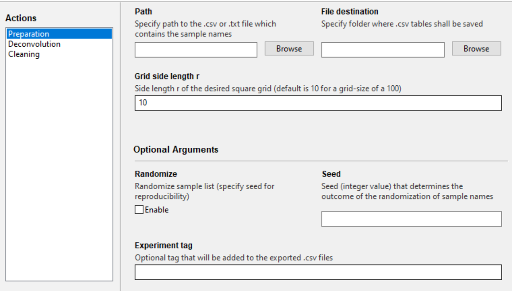
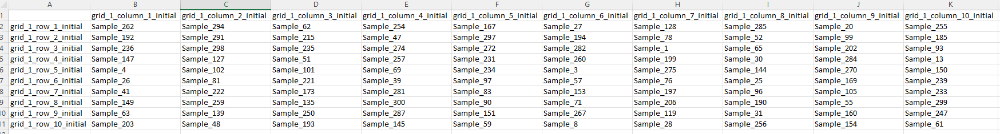
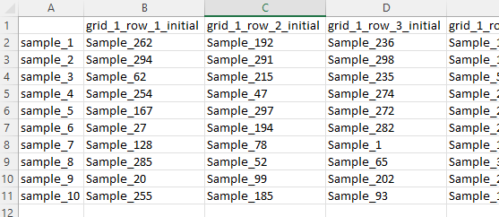
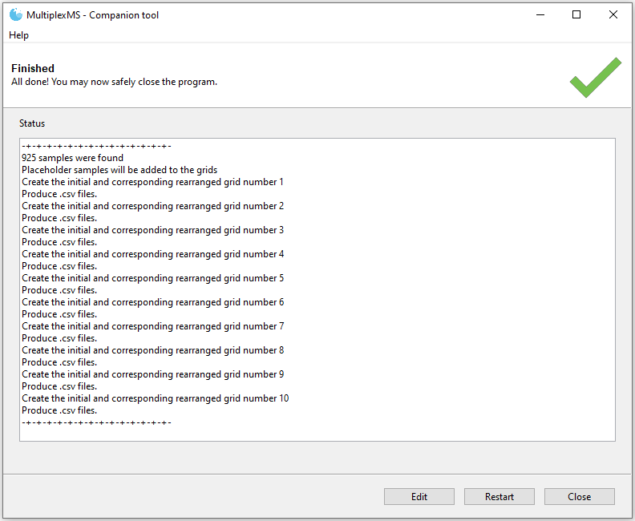
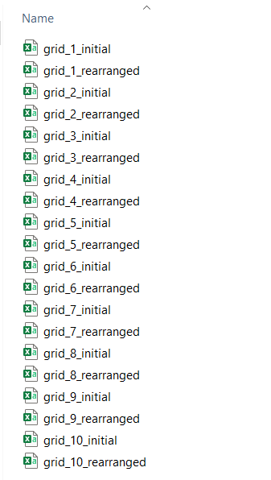

## Preparation of pooled samples tables

### The sample list

The sample list is a simple UTF-8 formatted CSV file (comma-delimited values) or tab-delimited .txt file that contains all the names of the samples that will be analyzed in a multiplexed fashion. If you created a list in Excel, choose <u>File</u> &rarr; <u>Save As</u> &rarr; save as type <u>CSV UTF-8 (Comma delimited) (.csv)</u>.The names will be used to create the tables that indicate how to pool the samples, but will also show up in the deconvoluted feature table. The respective table could look like this:

No header is needed and the sample names just need to be listed consecutively. Since randomization is an
optional step later on, the order of the list is not necessary of importance. However, if specific knowledge about the similarity of the sample's composition exists, ordering the samples to maximize dissimilarity between potentially mixed samples is encouraged.

### The *Preparation* tab in the companion tool

**Path** - Specify the path to the Sample list CSV

**File destination** - Folder where *grid*s and *preparation_tables* folder are created and stored

**Grid side length *r*** - Side length of the squared grid that is created behind the scenes.
									 Default is *r* = 10, resulting in virtual initial and rearranged 10 by 10 grids, where 20 pooled samples
                                     are created for each grid (40 pooled samples total). Each pooled sample would contain 10 individual samples.

**Randomize** - The sample list can randomized to create a random initial grid, whereby a rearranged grid is generated by the MMSO protocol. 
					     This step might be helpful to decrease the chance of mixing samples with potential
  					   chemical overlap.

**Seed** - In case randomization is desired, assigning a seed (integer value) allows to reproduce the
             randomization results.

**Experiment tag** - A text that is added to the end of the file name. The program automatically applies an underscore to the beginning of the experimental tag, so no need to add one to the beginning of the added text. If applying the randomization function above, it is suggested the user add any specified seed number to the experimental tag for records (example: seed_42). Special characters ('!@#$%^&*()-+?=,<>) are not allowed. 

### The *grids* and *preparation_tables* folders

Two folders are created by the *Preparation* function of the companion tool - the *grids* and the *preparation_table* folders. There is no need to tamper with the *grids* folder and especially the files within this folder, since they are used by the *Deconvolution* function later on. However, renaming the folder poses no problem. The files inside the *grids* folder must not be renamed. 

The *grids* come as a pair of two - an initial and rearranged grid. A typical file looks like this:

Shown is the initial grid for a randomized series of samples and a grid side length of *r* = 10.

The *preparation_tables* folder contains the files with pooled sample layout. It is ordered in the way that each pooled sample is represented by a column, containing X samples (10 in the lower example). The header of each column (e.g., grid_1_row_1_initial) indicates the pooled sample name. Those names need to be present in the pooled samples feature table following preprocessing for the *Deconvolution* function.

Depending on the specified grid size and the number of samples in the sample list, multiple initial and rearranged grids will be generated. For each initial/rearranged grid pair, there will be a designated grid number. For example, for a dataset containing 925 samples in 10 x 10 multiplexing grids (100 samples each), an initial and rearranged grid will be generated for each 100 samples. Therefore 10 total initial/rearranged grid pairs will be created with designations grid_1, grid_2... grid_10. The 925 samples will not occupy all 1000 possible locations in the 10 grids, so *placeholder* samples are used to fill the gaps (see **Placeholder samples** below for details).

The created grids will be saved in the **File destination**

### Placeholder samples

In case the sample count requires placeholder samples to fill up the virtual square grids, placeholder samples will also show up in the preparation table. We recommend to use the typical solvent (mix) that is used to prepare the samples for the LC-MS run, whenever a placeholder shows up. This shall guarantee that all pooled samples are at the same level of dilution. Another option is to use a QC sample in placeholder spots to ensure correct preparation and computational deconvolution by the program.

### MultiplexMS Demo
A demonstration of the MultiplexMS workflow with detailed instructions can be downloaded [here](https://github.com/liningtonlab/MultiplexMS/releases). A copy of the demo instructions can also be found under the *demo instructions* tab on the left panel.
